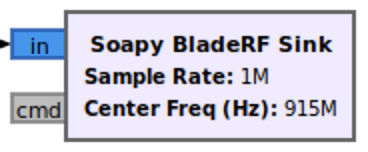
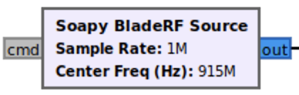

# Nuand bladeRF 2.0 micro

The bladeRF 2.0 micro is the second generation of highly capable SDRs produced
by Nuand, LLC. It will be the main SDR used for the CDC design project.

## Content

1. [Overview](#overview)  
2. [Command Line Interface](#command-line-interface)  
3. [libbladeRF](#libbladerf)
4. [SoapySDR](#soapysdr)
5. [gr-bladeRF](#gr-bladeRF)
6. [Performance](#performance)

## Overview

The key component on the bladeRF 2.0 board is an Analog Devices AD9361 wideband
transceiver, an RFIC which is also found in many other common SDRs (Ettus
USRP B series and ADALM PlutoSDRs).

The following is a list of useful references for understanding and using the
bladeRF. The bladeRF wiki is the best place to start.

- [bladeRF 2.0 micro](https://www.nuand.com/bladerf-2-0-micro/)
- [bladeRF wiki](https://github.com/Nuand/bladeRF/wiki)
- [libbladeRF documentation](https://nuand.com/bladeRF-doc/libbladeRF/v2.2.1/)
- [bladeRF source code](https://github.com/Nuand/bladeRF)
- [bladeRF 2.0 Schematic](datasheets/bladeRF-micro.pdf)

To use the bladeRF within our Ubuntu environment, it first must be connected to
the VM by selecting: *Devices > USB > Nuand bladeRF 2.0*

In CDC we will use the *xA9* version of the board, where board versions vary
only in the size of the onboard FPGA.

<div align="center">

| Version | Logic Elements |
| :-----: | :------------: |
|   xA4   |       49k      |
|   xA5   |       77k      |
|   xA9   |      301k      |

</div>

> **Important Note:** To avoid violating governmental regulations and damaging
> the hardware, please acknowledge and adhere to the following guidelines:
> - Never transmit or receive on any band on which you are not licensed to
> operate
> - Always terminate TX and RX ports with a 50 Ohm load (either an antenna or SMA
> terminator)
> - Never connect a TX port directly to an RX port without proper attenuation
> at least 30 dB)


## Command Line Interface

The `bladeRF-cli` command line utility can be used to verify device connectivity
as well as query and set device parameters. For complete information, see the
following references.

- [Verifying Basic Device Operation](https://github.com/Nuand/bladeRF/wiki/Getting-Started%3A-Verifying-Basic-Device-Operation)
- [bladeRF CLI Tips and Tricks](https://github.com/Nuand/bladeRF/wiki/bladeRF-CLI-Tips-and-Tricks)

For our purposes, we will only use `bladeRF-cli` to verify connectivity and not
to set device parameters. To ensure the bladeRF is correctly attached, the
`--probe` or `-p` command can be used.

```
$ bladeRF-cli -p # probe for connected bladeRF devices

  Description:    Nuand bladeRF 2.0
  Backend:        libusb
  Serial:         991431a963384f8289baea2ba586720d
  USB Bus:        2
  USB Address:    2
```

The command line tool also has an interactive mode, which can be a more
convenient way of querying and configuring the board.

```
$ bladeRF-cli -i # enter interactive mode
```

Within interactive mode you can check the bladeRF driver, device firmware, and
FPGA versions currently loaded.

```
bladeRF> version

  bladeRF-cli version:       1.8.0-0.2019.07.rbuild1
  libbladeRF version:        2.2.1-0.2019.07-4build1

  Firmware version:          2.3.2
  FPGA version:              0.11.0 (configured by USB)
```

You can also read expanded device information.

```
bladeRF> info

  Board:                    Nuand bladeRF 2.0 (bladerf2)
  Serial #:                 991431a963384f8289baea2ba586720d
  VCTCXO DAC calibration:   0x1d11
  FPGA size:                301 KLE
  FPGA loaded:              yes
  Flash size:               128 Mbit
  USB bus:                  2
  USB address:              2
  USB speed:                SuperSpeed
  Backend:                  libusb
  Instance:                 0
```

See `bladeRF --help` for a full list of possible commands.

## libbladeRF

Device drivers for configuring and streaming samples to and from the bladeRF
are provided by libbladeRF. Library functions can be incorporated directly into
C/C++ code or called from Python using the associated language bindings.

See the following documentation for more details.

- [libbladeRF documentation](https://nuand.com/bladeRF-doc/libbladeRF/v2.2.1/)

## SoapySDR Block

[SoapySDR](https://github.com/pothosware/SoapySDR/wiki) is a vendor neutral and
platform independent library that provides generic APIs to interface with
various SDR hardware. Within GNU Radio, we will be using the
*SoapySDR BladeRF Sink* and *SoapySDR BladeRF Source* blocks to configure and
stream samples to and from the bladeRF device, respectively.

<div align="center">




</div>

<br>
The following parameters are configurable through the GRC interface.

| Parameter         | Description |
| ----------------- | ----------- |
| Output/Input Type | Data type of samples consumed or produced by this block. The default type is a pair of 32-bit floating point numbers representing each complex IQ sample. The individual I and Q components are expected to be in the range -1.0 to +1.0. |
| Device arguments | Device specific arguments can be passed to libbladeRF through the SoapySDR API. See the table below for a list of possible arguments. |
| Sample rate      | The number of samples per second consumed or produced by this block and thus the front-end DAC or ADC rate. <br>**Range:** [521k, 61.44M] Samples/sec |
| Bandwidth        | Bandwidth of the RF Front-end analog filters. Typically this should be set equal to or smaller than the sample rate to reduce aliasing. Setting this value to `0.0` will automatically configure the bandwidth based on the sample rate but note this bandwidth will not be automatically updated if you change the sample rate during flowgraph execution. <br>**Range:** [200k, 56M] Hz |
| Center Freq      | The center frequency to which the RF chain is tuned. <br>**Range:** [70M, 6G] Hz |
| Freq Correction  | Optional offset term to correct for possible frequency offset of the device. |
| RF Gain          | Overall RF gain of the device. <br>**Tx range:** [-23.75, 66] dB <br>**Rx range:** [-15, 60] dB |

The parameters of the SoapySDR blocks can be updated during flowgraph execution
by using GRC variables and QT GUI control blocks, etc. It is also possible to
change the parameters by issuing commands to the `cmd` port of each block. This
ports is intended to simplify the control of the bladeRF from other blocks
within the flowgraph by relying on GNU Radio's
[message passing interface](gnuradio#message-passing).

A group of commands can be passed to a bladeRF block's *command* port as a GNU
Radio message, where the message *MUST* be a
[PMT dictionary](gnuradio#polymorphic-types-pmt).
The SoapySDR block will interpret each key in the dictionary as the parameter to
set with the corresponding value. An example of creating such a command message
in Python is shown below.

```python
# create PMT dict of bladeRF commands - set frequency and gain of channel 0
cmd = pmt.make_dict()
cmd = pmt.dict_add(cmd, pmt.intern("chan"), pmt.from_long(0))
cmd = pmt.dict_add(cmd, pmt.intern("freq"), pmt.from_double(2.45e9))
cmd = pmt.dict_add(cmd, pmt.intern("gain"), pmt.from_double(30))
```

The following table is a list of key commands currently supported on this
interface.

| Command     | Type   | Description                                         |
| ----------- | ------ | --------------------------------------------------- |
| `chan`      | int    | Specify which channel commands apply to (0).        |
| `gain`      | double | Set Tx or Rx RF gain.                               |
| `gain_mode` | bool   | Enable or disable Rx automatic gain control (AGC).  |
| `freq`      | double | Set Tx or Rx centre frequency.                      |
| `rate`      | double | Set Tx or Rx sample rate.                           |
| `bandwidth` | double | Set Tx or Rx bandwidth - 0 for default bandwidth.   |

**TODO:** Add list device specific arguments - streaming buffer configuration

## gr-bladeRF

Nuand releases a GNU Radio OOT module **gr-bladeRF** with blocks that can be
used to control and stream samples from a bladeRF device. It is now recommended
to use these blocks as the *SoapySDR* blocks appear to be silently dropping
samples. The *bladeRF Source* block also allows disabling the receiver AGC,
making it possible to set a fixed receive gain value. This will likely be
needed for implementing an energy detector within your secondary transmitter.

### Installation

The **gr-bladeRF** module depends on building and installing two other GNU Radio
OOT modules first: **gr-iqbal** and **gr-osmosdr**. Because the bladeRF driver
installed via the Ubuntu repositories is an older version of the library,
specific versions of these OOT modules must be built and installed for
everything to work. The required versions of the three modules are as follows.

<div align="center">

| OOT Module     | Branch/Commit |
| :------------: | :-----------: |
| **gr-iqbal**   |   `latest`    |
| **gr-osmosdr** |  `dev-gr-3.9` |
| **gr-bladeRF** |   `bc73edc`   |

</div>

The first step is to build and install Osomcom's **gr-iqbal** module.

```
$ git clone git://git.osmocom.org/gr-iqbal
$ cd gr-iqbal
$ git submodule update --init --recursive
$ mkdir build && cd build
$ cmake ..
$ make -j$(nproc)
$ sudo make install && sudo ldconfig
```

Next, build and install the `dev-gr-3.9` branch of Osmocom's **gr-osmosdr**
module.

```
$ sudo apt install libsndfile1-dev # dependency installed from Ubuntu repo
$ git clone https://github.com/Nuand/gr-osmosdr -b dev-gr-3.9
$ cd gr-osmosdr
$ mkdir build && cd build
$ cmake ..
$ make -j$(nproc)
$ sudo make install && sudo ldconfig
```

Finally, we can build and install Nuand's **gr-bladeRF** module. Make sure to
checkout out the `bc73edc` commit as this has been verified to work with the
installed bladeRF library versions.

```
$ git clone https://github.com/Nuand/gr-bladeRF.git
$ cd gr-bladeRF
$ git checkout bc73edc
$ mkdir build && cd build
$ cmake ..
$ make -j($nproc)
$ sudo make install && sudo ldconfig
```

The **gr-bladeRF** blocks should now be available in GRC. Note you likely want
to disable the hardcoded debug printing within **gr-bladeRF** by commenting out
line 43 in `./gr-bladeRF/lib/bladerf/bladerf_common.h`.

```c++
43 //#define BLADERF_DEBUG_ENABLE
```

### GRC Blocks

The bladeRF can be controlled by inserting the *bladeRF Source* and
*bladeRF Sink* blocks into your GNU Radio flowgraph.

<div align="center">


</div>

These blocks generally have similar parameters to the *SoapySDR* blocks but
with additional control over the setup of the device. Parameters common to both
the source and sink blocks are as follows.

| Parameter       | Description |
| --------------- | ----------- |
| Device          | Device serial ID. If not set the first device found is used. |
| Num Channels    | Number of TX/RX channels used. **Please keep at 1**. |
| Verbosity       | Log message severity level. Recommended to set as *Warning*. |
| Sample Rate     | IQ sample rate of transmit or receive channels, in samples per second. |
| Frequency       | Centre or carrier frequency of device of transmit or receive channels, in Hz. |
| Bandwidth       | Analog bandwidth of RF-frontend, in Hz. Typically set to *Sample Rate* or smaller. |
| Reference Clock | This parameter must be set but should be ignored by the block. Set to 38400000 to be safe. |

Receive specific parameters for the *bladeRF Source* block are as follows.


| Tx Parameter      | Description |
| ----------------- | ----------- |
| DC Offset Mode    | Mode of DC offset correction: False (Off), Manual, or Automatic. Recommended to set to Automatic. |
| IQ Imbalance Mode | Mode of IQ imbalance correction: False (Off), Manual, or Automatic. Recommended to set to Automatic. |
| AGC               | AGC mode: False (Off) or True (On). |
| RF Gain           | Receive RF front-end gain setting employed if AGC is disabled, in dB. |


Transmit specific parameters for the *bladeRF Sink* block are as follows.

| Rx Parameter    | Description                                 |
| --------------- | ------------------------------------------- |
| RF Gain         | Transmit power gain of RF front-end, in dB. |

## Performance

This section will describe procedures for characterizing performance of the
bladeRF boards and report typical results.

Metrics:
- USB throughput
- Noise figure/floor
- Frequency Stability
- DC offset
- IQ imbalance
