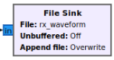
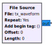

# Debugging

## Contents

1. [File Sink and Source](#file-sink-and-source)

## File Sink and Source

GNU Radio flowgraphs are real-time signal processing applications that typically
operate on continuous streams of data. This can make it difficult to investigate
signal characteristics or debug unexpected behaviour. The GNU Radio *File Sink*
and *File Source* blocks are a handy way to allow offline investigation of the
signal at various points in your flowgraph using Python scientific libraries or
MATLAB.

When included in your flowgraph, the *File Sink* block will save data samples
to a binary file that can then be loaded as an array in Python or MATLAB.
Similarly, a known test waveform can be generated in Python or MATLAB and then
fed into your flowgraph using the *File Source* block. The combination of sink
and source can also be used to save a waveform for latter playback.

See the following GNU Radio documentation pages to understand these blocks and
how to binary waveforms files can be loaded/created in MATLAB and Python.

- [GNU Radio File Sink](https://wiki.gnuradio.org/index.php/File_Sink)
- [GNU Radio File Source](https://wiki.gnuradio.org/index.php/File_Source)
