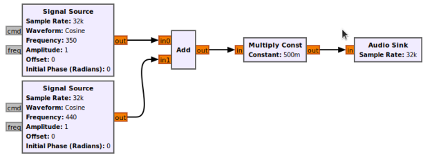
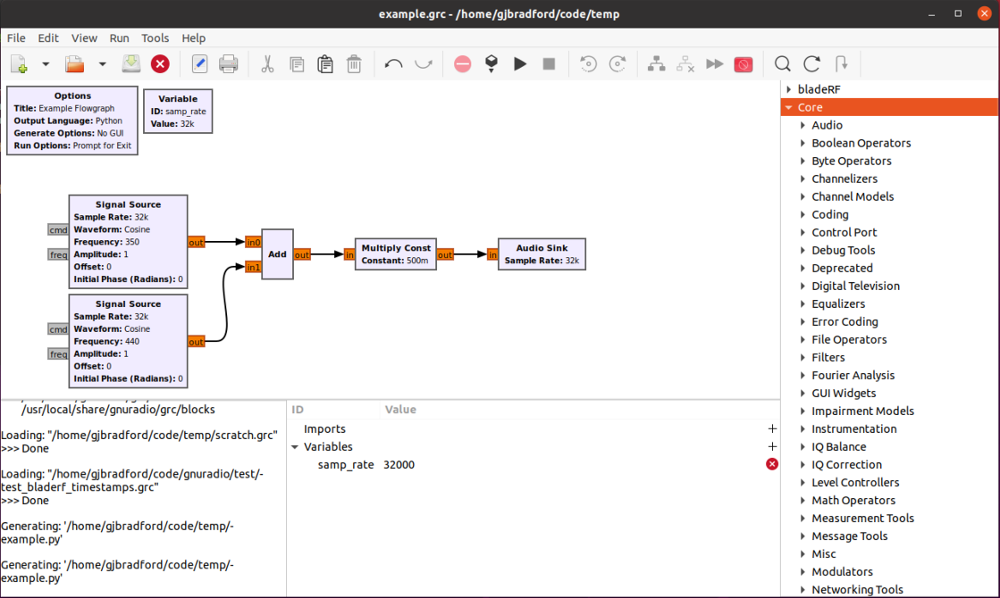
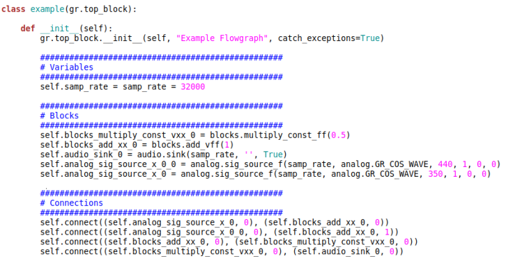

# GNU Radio

GNU Radio is an open-source framework for creating signal processing
applications that run on general-purpose processors. It is widely used in
research, industry, and academia, and it can be combined with SDR hardware to
create real-world communication systems.

- [GNU Radio Project](https://gnuradio.org)

GNU Radio will be the main framework supported in CDC for implementing your
design project solutions.

## Contents

1. [Documentation](#documentation)
2. [Flowgraphs](#flowgraphs)
3. [The GNU Radio Companion (GRC)](#the-gnu-radio-companion-grc)
4. [Python Flowgraphs and Blocks](#python-flowgraphs-and-blocks)
5. [Out-of-tree Modules and C++ Blocks](#out-of-tree-modules-and-c-blocks)
6. [Advanced GNU Radio Concepts](#advanced-gnu-radio-concepts)
    - [Polymorphic Types (PMTs)](#polymorphic-types-pmts)
    - [Message Passing](#message-passing)
    - [Stream Tags](#stream-tags)
    - [Profiling](#profiling)
    - [VOLK](#volk)

## Documentation

There is a large amount of documentation available for GNU Radio.

- [GNU Radio Wiki](https://wiki.gnuradio.org)
- [GNU Radio Usage Manual](https://wiki.gnuradio.org/index.php?title=Usage_Manual)
- [GNU Radio C++ API](https://www.gnuradio.org/doc/doxygen/)
- [GNU Radio source code on Github](https://github.com/gnuradio/gnuradio)

In particular, the GNU Radio wiki has a suite of useful
[beginner and intermedia tutorials](https://wiki.gnuradio.org/index.php?title=Tutorials),
many of which are referenced below. These should be your starting point to
better understand concepts important in developing GNU Radio applications.

The wiki also has documentation for many GNU Radio signal processing blocks
which explain their configuration and operation. Unfortunately, not all of the
documentation is complete, so at times you may need to investigate a block or
object's source code should you wish to use it. See the Python and C++ sections
below for more information on understanding GNU Radio blocks.

## Flowgraphs

Applications are created in GNU Radio by constructing flowgraphs, which are
collections of interconnected signal processing blocks. The specific blocks
used, their configuration, and the manner in which they are connected dictates
the functionality of your application. Flowgraphs can be created graphically,
in Python, or in C++.



Blocks in a flowgraph perform defined signal processing operations, with source
blocks generating data, other blocks processing data, and sink blocks consuming
data. In the above example, two *Signal Source* blocks generate cosine waveforms
with frequencies of 350 and 440 Hz, the *Add* block combines these two
waveforms, and then the result is played on the computer's sound card.

Once execution of a flowgraph commences, the GNU Radio scheduler handles
scheduling block processing and the piping of generated data at the output port
of an upstream block to the input port of the block downstream. This results in
data streams flowing through the graph, where streams of data can be of
different types (bytes, integers, floats, complex, etc.). For real-time
operation, all blocks in the flowgraph must be able to keep up with the rate of
arriving data on their input ports. GNU Radio functionality can be extended by
writing new blocks in either Python or C++.

See [What is GNU Radio](https://wiki.gnuradio.org/index.php?title=What_Is_GNU_Radio)
for an additional overview.

## The GNU Radio Companion (GRC)

The GNU Radio Companion, or GRC, is a graphical tool for creating and running
GNU Radio flowgraphs and can be used very much like Simulink or LabVIEW. It is
the easiet way to create new applications when the libary of existing signal
processing blocks is sufficient for your needs.



See the following GRC tutorials:
- [Your First Flowgraph](https://wiki.gnuradio.org/index.php?title=Your_First_Flowgraph)
- [Python Variables in GRC](https://wiki.gnuradio.org/index.php?title=Python_Variables_in_GRC)
- [Runtime Updating Variables](https://wiki.gnuradio.org/index.php?title=Runtime_Updating_Variables)
- [Signal Data Types](https://wiki.gnuradio.org/index.php?title=Signal_Data_Types)
- [Converting Data Types](https://wiki.gnuradio.org/index.php?title=Converting_Data_Types)
- [Packing Bits](https://wiki.gnuradio.org/index.php?title=Packing_Bits)
- [Streams and Vectors](https://wiki.gnuradio.org/index.php?title=Streams_and_Vectors)

It is often convenient to make commonly used block combinations into a
*hierarchical block* that can be imported into a flowgraph as a single super
block. To do so in GRC, see:
- [Hier_Blocks and Parameters](https://wiki.gnuradio.org/index.php?title=Hier_Blocks_and_Parameters)

## Python Flowgraphs and Blocks

The Python programming language is one of two languages used within GNU Radio.
As an interpreted language with intuitive syntax, it is well-suited for
specifying flowgraphs to create applications. In fact, under the hood GRC is
just generating a Python script that instantiates your designed flowgraph.
Flowgraphs can be defined directly in Python instead.

See the following GNU Radio tutorial on understanding a flowgraph's Python code:

- [Flowgraph Python Code](https://wiki.gnuradio.org/index.php?title=Flowgraph_Python_Code)



Python is also quick and convenient for implementing some signal processing
blocks in GNU Radio, but these should generally be blocks that are not
computationally intensive. As an interpreted language, Python will generally be
slower than compiled C++ code, the other language used in GNU Radio.

See the following GNU Radio tutorials on creating Python blocks:
- [Creating Your First Block](https://wiki.gnuradio.org/index.php?title=Creating_Your_First_Block)
- [Python Block with Vectors](https://wiki.gnuradio.org/index.php?title=Python_Block_with_Vectors)

## Out-of-tree Modules and C++ Blocks

As an interpreted language, Python is very flexibile and easy to program in but
may be too slow for creating blocks that must perform a large amount of
computations. Instead, the bulk of blocks in GNU Radio are implemented in C++
for execution speed. You can create your own C++ blocks but this is more
challenging than writing blocks in Python. GNU Radio functionality is extended
through the creation of Out-of-Tree (OOT) modules that also conveniently setup
the details you need to successfully compile new C++ blocks.

See the following GNU Radio tutorials on out-of-tree modules and writing C++
blocks:

- [Out of Tree Modules](https://wiki.gnuradio.org/index.php?title=OutOfTreeModules)
- [Writing blocks in C++](https://wiki.gnuradio.org/index.php?title=Guided_Tutorial_GNU_Radio_in_C%2B%2B)
- [YAML GRC](https://wiki.gnuradio.org/index.php?title=YAML_GRC)

There is an extensive library of third-party OOTs available on the
[Comprehensive GNU Radio Archive Network (CGRAN)](https://cgran.org).

## Advanced GNU Radio Concepts

### Polymorphic Types (PMTs)

Polymorphic Types (PMTs) are a GNU Radio construct used to represent concrete
data types (bytes, integers, vectors, etc.) in an abstract way. They are a
fundamental enabler of passing data between blocks through the use of stream
tags and message passing.

See the following GNU Radio tutorial on PMTs:
- [Polymorphic Types (PMTs)](https://wiki.gnuradio.org/index.php?title=Polymorphic_Types_(PMTs))

### Message Passing

By default, data passes between blocks as a continuous stream of samples. Many
functions in communication systems, however, are better modeled by the
asynchronous passing of data blocks of a given size. These data blocks are
called *messages* in GNU Radio, and *message passing* is an alternative way of
passing data or control information between blocks. Message passing also
simplifies the interaction of external entities with a flowgraph.

See the following GNU Radio tutorials on message passing:
- [Python Block Message Passing](https://wiki.gnuradio.org/index.php?title=Python_Block_Message_Passing)
- [Message Passing](https://wiki.gnuradio.org/index.php?title=Message_Passing)

### Stream Tags

Stream tags allow control information to be attached or *tagged* to a specific
data sample in a given stream. This is useful for passing control or
configuration information to downstream blocks with an associated time validity.

See the following GNU Radio tutorials on stream tags:
- [Python Block Tags](https://wiki.gnuradio.org/index.php?title=Python_Block_Tags)
- [Stream Tags](https://wiki.gnuradio.org/index.php?title=Stream_Tags)

### Profiling

Because communication systems interact with the physical world, they must be
able to process their data in real-time, that is to say, they must be able to
keep up with the associated sample rate at which they are operating. For a GNU
Radio flowgraph, this means all blocks in the flowgraph must be able to keep up
with the rate data are arriving on their input ports. This is obviously limited
by the overall processing power of the machine on which the application is
running and the complexity of the flowgraph. It can be very helpful to know how
much processing time each block in a flowgraph is taking in order to look for
bottlenecks, which can be done using *performance counters*.

See the following GNU Radio usage page on performance counters:
- [Performance Counters](https://wiki.gnuradio.org/index.php?title=Performance_Counters)

To enable performance counters in your flowgraph, open the GNU Radio
configuration file in an editor (in this case Microsoft Visual Studio Code).

```
$ code ~/.gnuradio/config.conf
```

Look for the `[perfcounters]` section and ensure that `on` is set to `True`. Add this section to the configuration file if it is missing.

```
[perfcounters]
clock = thread
export = False
on = True
```

Performance counters will add overhead to your application, so you only want to
enable them when you are profiling.

The list of available performance counter functions can be found in `gr::block`
[class reference](https://www.gnuradio.org/doc/doxygen/classgr_1_1block.html).
We list some of the most useful counters in the following table.

| Class Method | Description |
| ----------------------  | ------------------------------------------|
| `pc_nproduced_avg()`    | Gets average num items produced.          |
| `pc_work_time_avg()`    | Gets average clock cycles spent in work.  |
| `pc_work_time_total()`  | Gets total clock cycles spent in work.    |
| `pc_throughput_avg()`   | Gets average throughput.                  |
| `reset_perf_counters()` | Resets the performance counters.          |

As an example, if you wished to know how efficiently your block was implemented,
you could look at the ratio of the average number of items produced to
average time spent producing those items.

```python
# Example of accessing performance counters in a Python block
work_time_avg = self.pc_work_time_avg()
nproduced_avg = self.pc_nproduced_avg()
nitems_per_cycle = nproduced_avg / work_time_avg
```

Here a larger `nitems_per_cycle` would be a more efficient block.

### VOLK

Hardware-based solutions have historically been the preferred way to implement
the physical layer of communication systems as they allow a high degree of
parallelism to be achieved and can thus keep up with the processing needs of
such applications. The microprocessors that run software-based solutions operate
sequentially, but modern processors have vectorised instructions that allow the
same operation to be applied to multiple data points simultaneously. This can
significantly increase the rate data can be processed. GNU Radio uses a
convenient library called the Vectorized Optimized Library of Kernels (VOLK) to
make these vectorised instructions easily accessible.

See the following GNU Radio tutorial on using VOLK:
- [VOLK Guide](https://wiki.gnuradio.org/index.php?title=VOLK_Guide)
