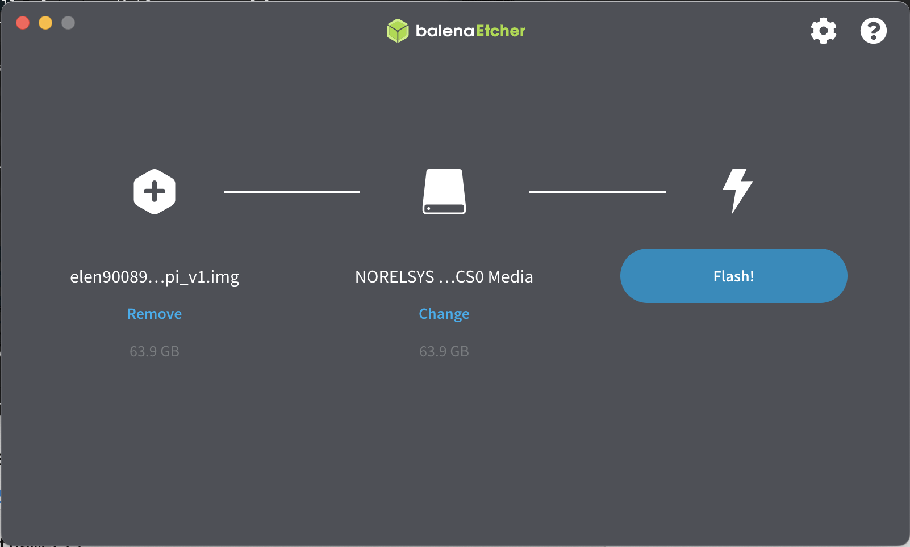
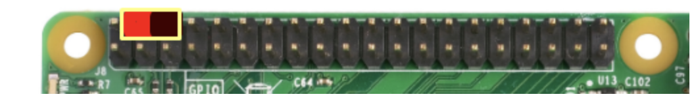

# Raspberry Pi

As an alternative to the FEIT lab computers, CDC teams will have access to
[Raspberry Pi 4](https://www.raspberrypi.com/products/raspberry-pi-4-model-b/specifications/)
single board computers with 4GB of RAM. These boards can help avoid
unforeseen virtualization issues, simplify over-the-air testing, and support
project work outside of workshop hours. Note your team will need to investigate
the sustainable data rate possible with the processing power of provided by the
Raspberry Pi.

## Ubuntu Image

To run GNU Radio on the Raspberry Pi, an Ubuntu Desktop 22.04.2 LTS (64-bit)
disk image is available with the following pre-installed components.

- GNU Radio
- gr-bladeRF
- gr-cdc

The image can be downloaded from the following link.

- [elen90089_2023_rpi_v1.img.zip](https://unimelbcloud-my.sharepoint.com/:u:/g/personal/glenn_bradford_unimelb_edu_au/EaHROosVr31DjrMiSimk8rUBXITkkpKd2UQDzysBZhN4NA?e=ktaMbA) (3.9 GB)

Once downloaded and unzipped, you can flash the SD card using a tool such as
[Balena Etcher](https://www.balena.io/etcher).

<div align="center">



</div><br>


Account credentials are the same as for the FEIT Ubuntu VM.

- username: *cdc*
- password: *sdr*

The Raspberry Pi board includes has an installed
[heatsink case](https://core-electronics.com.au/dual-fan-aluminium-heatsink-case-for-raspberry-pi-4-black.html?gclid=EAIaIQobChMIp6nh5MiR_gIVwQorCh2JkA9lEAQYAiABEgLB6vD_BwE)
for active cooling. Connect the red and black wires of the heatsink fans to the
Raspberry Pi power and ground pins as shown below.

<div align="center">



</div>

## Network Setup

The Raspberry Pis should automatically connect to the Uni wireless network in
certain EDS rooms (1, 7, 8, and 10). EDS12 should be added to this list
soon. However, you must first update the hostname to match the device number
marked on your device (which should be in the range 1 - 10). The expected
hostname format is `asc##-rpi` where `##` is the two digit device number. To
change the device number, for example on device 1, run the following command.

```
$ sudo hostnamectl asc01-rpi
```

The following table lists the hostname and static IP address assigned to each
device on the Uni wireless network.

<div align="center">

| RPi  | Hostname                     |  IPv4 Address |
| :--: | :--------------------------: | :-----------: |
|   1  | asc01-rpi.eng.unimelb.edu.au | 10.41.146.234 |
|   2  | asc02-rpi.eng.unimelb.edu.au | 10.41.146.244 |
|   3  | asc03-rpi.eng.unimelb.edu.au | 10.41.146.247 |
|   4  | asc04-rpi.eng.unimelb.edu.au | 10.41.146.248 |
|   5  | asc05-rpi.eng.unimelb.edu.au | 10.41.146.250 |
|   6  | asc06-rpi.eng.unimelb.edu.au | 10.41.146.251 |
|   7  | asc07-rpi.eng.unimelb.edu.au | 10.41.146.252 |
|   8  | asc08-rpi.eng.unimelb.edu.au | 10.41.146.254 |
|   9  | asc09-rpi.eng.unimelb.edu.au | 10.41.147.2   |
|  10  | asc10-rpi.eng.unimelb.edu.au | 10.41.147.3	  |

</div>

To connect to another WiFi network, e.g., at home, you can either join the
network in *Settings* or run the following command.

```
$ sudo nmcli device wifi connect <ssid>
```

You should then be prompted for the network's password.

## Remote Access

If your Raspberry Pi has network connectivity, headless access (without
connecting a monitor and keyboard) is possible. You will need to install an SSH
client on your local machine.

- Windows: [PuTTY](https://www.putty.org/)
- Mac and Linux: OpenSSH (should come pre-installed)

You can then remotely login into the the device.

```
$ ssh cdc@asc01-rpi.local
```

Or if on the university network, use the `eng.unimelb.edu.au` domain name.

```
$ ssh cdc@asc01-rpi.eng.unimelb.edu.au
```

Graphical applications (e.g., GRC) can be accessed remotely through X11 window
forwarding. This requires you to install an X server on your local machine.

- Windows: [Xming](https://sourceforge.net/projects/xming/)
- Mac OS X: [XQuartz](https://www.xquartz.org/)

First open the X server program and then ssh into the remote machine with X11
forwarding enabled. To enable on Linux or Mac include the `-X` flag.

```
$ ssh -X cdc@asc01-rpi.local
```

For PuTTY, make sure to tick the appropriate configuration box before
connecting.

- *Connection >> SSH >> X11 >> Enable X11 Forwarding*

Graphical applications opened on the remote machine should now be forwarded to
your local machine. Make sure there is no monitor connected to the device or
certain windows might not get forwarded. You can verify everything is working
properly by opening GRC.

```
$ gnuradio-companion &
```

You are also welcome to experiment with accessing the Raspberry Pi via VNC or
remote desktop, but you will need to configure or install remote access on the
device.
