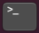

# Software Basics

As its name would suggest, the use of software-defined radio to implement
communication algorithms requires some programming ability along with knowledge
of related software development tools and processes. Although the number of
topics included can be a bit daunting at first, a strong understanding of
programming and computing is invaluable to engineers of all disciplines. Strong
software development skills can offer you additional flexibility and
opportunities in terms of career progression.

This page provides a number of references you may find useful in getting up to
speed for the CDC design project.

## Contents
1. [The Linux Command Line](#the-linux-command-line)
2. [Git Version Control](#git-version-control)
3. [C++ Programming Language](#c-programming-language)
4. [Python Programming Language](#python-programming-language)

## The Linux Command Line

The primary software environment used in CDC will be Ubuntu Linux, often run as
a virtual machine (VM) on the FEIT lab computers. See [Environments](environment.md)
for information about how to access the FEIT Desktop image remotely. An
efficient way for interacting with Linux is the use of the command line (also
called the terminal, shell, or prompt), a textual interface to issue commands
for execution by the Linux OS. On Ubuntu you can open the terminal by clicking
on the following icon: 

If you are unfamiliar with the Linux command line or feel you need a refresher,
the following tutorials and guides are helpful.

- [Ubuntu command line for beginners](https://ubuntu.com/tutorials/command-line-for-beginners#1-overview)
- [Linux commands cheat sheet](https://cheatography.com/davechild/cheat-sheets/linux-command-line/)
- [linuxcommand.org](https://linuxcommand.org)
- [Software carpentry shell tutorial](https://swcarpentry.github.io/shell-novice/)
- [Unix Tutorial for Beginners](http://www.ee.surrey.ac.uk/Teaching/Unix/)

Some of your CDC peers likely have experience with Linux and thus will be a
good source for help. When forming a project team you may consider ensuring at
least one team member has moderate programming experience.

## Git Version Control

A version control tool tracks changes to the software codebase of a project,
allowing multiple team members to develop concurrently. Such tools allow for
rolling back to previous versions of code when mistakes are introduced and for
the merging of conflicting changes made to the codebase by different developers.
These days, Git is the most widely used version control tool for managing source
code.

You can create your own projects and repos on Gitlab and are strongly encouraged
to do so as part of the management of your design project. Login to Gitlab with
your normal university credentials.

- [UoM Engineering Gitlab](https://gitlab.eng.unimelb.edu.au)

Git takes a little bit of practice, so make sure to checkout the following
tutorials and references.

- [Atlassian Bitbucket Tutorial](https://www.atlassian.com/git/tutorials/what-is-version-control)
- [Git Handbook on Github Guides](https://docs.github.com/en/get-started/using-git/about-git)
- [Git cheatsheet on Github](https://training.github.com/)
- [MUEEC's Basics of Git Workshop](https://www.youtube.com/watch?v=vUgsyfbOUl4)

> **Important Note:** Version control tools like Git work best with textual
> programming languages such as Python and C++. They have more limited
> functionality for resolving conflicts in the graphical flowgraphs created with
> GRC (*.grc). They do, however, allow reverting to older versions of your
> flowgraph.

## Python Programming Language

A key design feature of GNU Radio is the use of the Python programming language
for creating application flowgraphs, computationally non-intensive signal
processing blocks, and scripting work. Python is an interpreted general-purpose
programming language that is very popular among computer scientists, data
analysts, and engineers. It consistently ranks as one of the most widely used
languages.

The design philosophy behind Python is to make programming easy and fun, which
has resulted in a very accessible and readable syntax. The following is an
example of defining a simple Python function.

```python
# example of Python's clean syntax
def my_divide(a, b):
    c = a / b
    return c
```

Python has an extensive standard library and is easily extended by others. See
the [Python Package Index (PyPI)](https://pypi.org) for a large collection of
third party libraries expanding Python's functionality. Chances are, whatever
you are trying to do someone has already created a Python module that can help
you.

Some basic Python programming knowledge will be needed to develop applications
in GNU Radio. The following are useful tutorials and references to start
learning the language.

- [Beginner's Guide to Python](https://wiki.python.org/moin/BeginnersGuide)
- [The Python Tutorial](https://docs.python.org/3.9/tutorial/)
- [The Python Language Reference](https://docs.python.org/3.9/reference/)

Scientific computing functionality, similar to that of MATLAB, is also possible
with Python using the [NumPy](https://numpy.org), [SciPy](https://scipy.org),
and [Matplotlib](https://matplotlib.org) packages. NumPy adds array and matrix
support to Python along with a host of efficient mathematical calculation
routines. You will need basic knowledge of NumPy arrays when creating or
analyzing GNU Radio blocks in Python.

- [NumPy for absolute beginners](https://numpy.org/devdocs/user/absolute_beginners.html)
- [NumPy for MATLAB Users](https://numpy.org/devdocs/user/numpy-for-matlab-users.html)

As an *interpreted* language, Python code is not precompiled to executable
machine code but rather parsed and then executed by an intermediate interpreter.
This makes Python very flexible and easy to use but means it is often not fast
enough to implement computationally intensive signal processing blocks. See the
next section on C++ for these cases.

## C++ Programming Language

In GNU Radio, most signal processing blocks are implemented using C++ as it is
a highly efficient *compiled* language. C++ is another very popular language
that is an object-oriented extension of the C language. You should have some
familiarity with C through Embedded System Design. An understanding of C++ will
be helpful in understanding what certain GNU Radio blocks are doing as well as
creating your own blocks should you choose to do so.

 - [C++ Language Tutorial](https://www.cplusplus.com/doc/tutorial/)
 - [W3 School's C++ Tutorial](https://www.w3schools.com/CPP/cpp_intro.asp)
