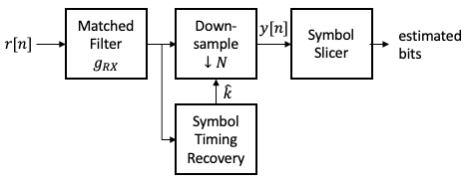
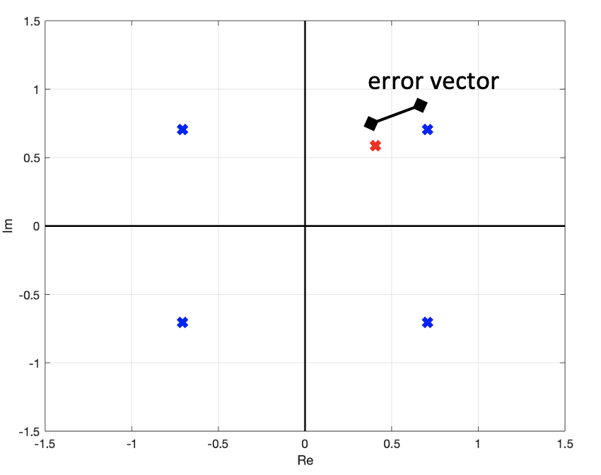
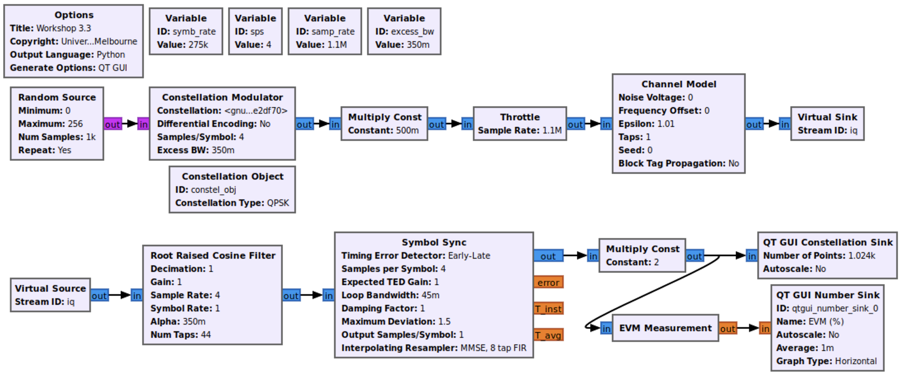

# Symbol Synchronization

Please reference the lecture slides for workshop 3 as needed.

* [Workshop 03 - Symbol Sychronization](https://canvas.lms.unimelb.edu.au/courses/151467/pages/workshop-03-symbol-synchronization?module_item_id=4520655)

## 3.1 - Constellation Modulator

In this activity you will implement a basic digital transmitter that streams a
continuous sequence of random QPSK symbols. We will use this basic transmitter
to investigate some of the key subsystems in a practical digital receiver.
Consider the following block diagram of a pulse modulation communication
systems.

<div align="center">


</div>

Key elements in our transmit chain include the following.

* *Symbol mapper* – maps a stream of input bits to a stream of complex-valued
symbols taken from some constellation, e.g., BPSK, QPSK, or 16QAM.
* *Upsampler* – inserts zeros between our symbols to increase the sampling
rate. We must oversample our signal when using a pulse shape with excess
bandwidth. Why?
* *Pulse-shaping filter* – filters our upsampled symbol sequence to ensure
the signal is bandlimited. We often use filter coefficients, $g[k]$, defined by
a Root Raised Cosine (RRC) pulse with a configurable excess bandwidth
parameter.
* *Digital-to-analog converter (D/A)* – converts baseband digital waveform
(discrete-valued, discrete-time) to a baseband analog waveform 
(continuous-valued, continuous-time).
* *Upconversion* – applies quadrature modulation to shift our complex signal
directly from baseband (centred about 0 Hz) to passband (centred about our
carrier frequency $f_c$).

<div align="center">


</div>

Implement the GRC flowgraph as depicted above. It should be clear what variables
to used in configuring the various blocks but make sure you define the
sample rate variable *samp_rate* as a function of the symbol rate and the
number of samples per symbol, i.e.,`samp_rate = symb_rate * sps`. Note the 
scaling factor applied at the output of *Constellation Modulator*. This
is to normalize the QPSK constellation to unit energy as points in the 
constellation are at $(\pm \sqrt{2} \pm j\sqrt{2})$.

> **FLUX Questions:**  
> 1. Run your flowgraph and try a few different values for the
>    samples-per-symbol (*sps*) and the excess bandwith (*excess_bw*)
>    parameters. How does the output spectrum change?
>    <br>**Note:** The *Constellation Modulator* parameters CANNOT be
>    updated while running the flowgraph.  
> 2. Increase the symbol rate to 500 kSymb/s and then rerun your flowgraph.
>    Does the change in output spectrum align with your expectations?  

## 3.2 Manual Symbol Synchronization

You will now focus only on recovering the symbol timing of the transmitted
waveform. We will add a symbol timing recovery subsystem that takes as input
the output of the received matched filter and outputs the sample closest to
the optimal sampling time. 

<div align="center">



</div>

To begin, you will manually select the best sampling offset, $\hat{k}$, based on
visual observation.

<div align="center">


</div>

The *Root Raised Cosine Filter* implements the matched filtering with a digital
RRC pulse. The *Keep 1 in N* block decimates our waveform by a factor of *sps*
down to the symbol rate. By adjusting the *delay* variable we can change the
sample offset that is passed by the decimator, allowing us to adjust the symbol
sampling point to be as close as possible to the optimal timing.

Update your receiver flowgraph based on the manual symbol timing recovery
system as depicted in the figure above. Parameters for the RRC filter are listed
below for your convenience.
<br>**Note:** The *delay* variable must be an integer and NOT a float for the
*Delay* block to function properly.


| RRC Parameter |    Value    |
| ------------- | :---------: |
| Decimation    |    `1.0`    |
| Gain          |    `1.0`    |
|Sample Rate    |    `sps`    |
| Symbol Rate   |    `1.0`    |
| alpha         | `excess_bw` |
| Num Taps      |   `11*sps`  |

> **FLUX Questions:**  
> 3. Run your flowgraph and observe the constellation on the *QT GUI
>    Constellation Sink*. How does the constellation change as you adjust the
>    delay?  
> 4. Increase the oversampling rate by trying values of 4 and 8 for *sps*. How
>    does the oversampling rate affect the constellation at different delays?  

Before automating the symbol timing recovery process, we would first like to
determine a metric to quantify the deviation of the received constellation from
the ideal points. A common metric employed by communication engineers to
assess degradation in a symbol constellation is the *error vector magnitude* or
*EVM*. It is a useful measurement of performance both at the transmitter and
the receiver. At the transmitter it captures phase and amplitude distortions
introduced by the analog front-end, while at the receiver it captures these
effects plus interference, noise, and residual errors after impairment
compensation.

<div align="center">



</div>

As show in the figure above, the error vector of a given received symbol is the
distance from that symbol (red x) to its ideal location in the complex plane
(blue x). The EVM of a group of M observed symbols will be defined as the RMS
average magnitude of their error vectors normalized by the maximum ideal
constellation magnitude. It is typically expressed as a percentage.

```math
EVM = \frac{ \sqrt{\frac{1}{M} \sum_{i=0}^{M-1} |y[i] - a[i]|^2 } }{\max_j |c_j|} \text{ where } a[i]\in\{c_0, c_1, \dots\}
```

Here, $c_j$ are the ideal points in our constellation, $a[i]$ is the ideal
location of the symbol transmitted at time $i$ and $y[i]$ is the actually
transmitted or received symbol at time $i$. You will notice there are parallels
between the definition of EVM and SNR. An increase in EVM will result in a
decreaes in SNR and an increase in the observed BER. GNU Radio has a block for
computing the EVM that we can include in our flowgraphs.

<div align="center">


</div>

Add the *EVM Measurement* block to your flowgraph to measure the
EVM of your received constellation, connecting the output to a *QT GUI
Number Sink*. Note that EVM is expressed as a percentage and thus falls
between 0 and 100.
<br>**Hint:** You can add exponential averaging to *QT GUI Number Sink* by
entering an average parameter value between 0.0 and 1.0.

> **FLUX Questions:**  
> 5. How does the EVM vary as you change the delay value of your manual timing
>    recovery system?  
> 6. How does the EVM change if you first increase the oversampling factor sps
>    and then vary the delay parameter?  

## 3.3 Timing Recovery Loop

You will now replace your manual symbol timing correction with GNU Radio's
*Symbol Sync* block. This block is a feedback-based timing correction block
composed of a timing error detector (TED), proportional-integral (PI) loop
filter, and sample interpolator. There are multiple options for both the TED
and interpolating filter. For this workshop you will use the Early Late TED
(ELTED) and 8-tap MMSE interpolator.

<div align="center">



</div>

Construct the GNU Radio flowgraph as depicted above. Note that we have included
a *Channel Model* block to create a sample clock offset between the transmit
and receive chains. If the sampling rate of the input to *Channel Model* is 
$F_{in}$, then sample rate of the output will be at 
$F_\text{out} = \epsilon \cdot F_\text{in}$.

> **FLUX Questions:**  
> 7. What EVM do you measure after symbol synchronization?  
> 8. Try different values of $epsilon$ in the *Channel Model* block. At what
>    $epsilon$ does your symbol synchronizer no longer work?  

## 3.4 RF Loopback

Now that we have investigated symbol timing recovery in simulation, let's move
on to see if our system works with our real-world hardware! Create an RF 
loopback by physically connecting the output of the *TX1* port to the *RX1*
port **with a 30 dB attenuator inline**. A friendly reminder that...

> **Important Note:** To avoid violating governmental regulations and damaging
> the hardware, please adhere to the following guidelines.
> 1. Never transmit or receive on any band on which you are not licensed to
>    operate.
> 2. Always terminate TX and RX ports with a 50 Ohm load - either an antenna or
>    SMA terminator.
> 3. Never connect a TX port directly to an RX port without proper attenuation
>    of at least 30 dB.

We will use the following flowgraph to create our RF loopback experiment.

<div align="center">


</div>

Implement the RF loopback flowgraph as depicted in the figure above. There are
a few important things to note when creating this flowgraph. First, the bladeRF
expects sample values in the range (-1.0, 1.0) and thus we have provide additional
scaling in *Multiply Const* block after *Constellation Modulator*. Second, in
future workshops we will address the issue of channel estimation and carrier
offset correction. Because we do not have these subsystems present, the received
constellation has a fixed amplitude scaling and random phase shift relative to
the ideal constellation points. You will manually correct for these by observing
the output constellation. Update the *Multiply Const* block such that
*Constant* is `amplitude * np.exp(1j*phase)`. This expression uses the Numpy
Python package which must be included in an *Import* block as follows:
`import numpy as np`.

> **FLUX Question:**  
> 1.Run your flowgraph and observe the received signal constellation. Adjust
> the *amplitude* and *phase* scaling variables to align the received symbol
> constellation with the transmitted constellation. This should minimize the
> EVM. What EVM do you measure after symbol synchronization in your RF
> loopback?
