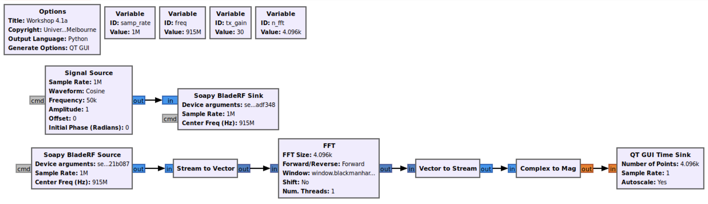
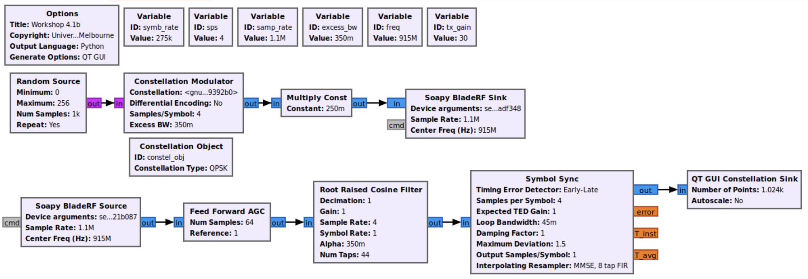
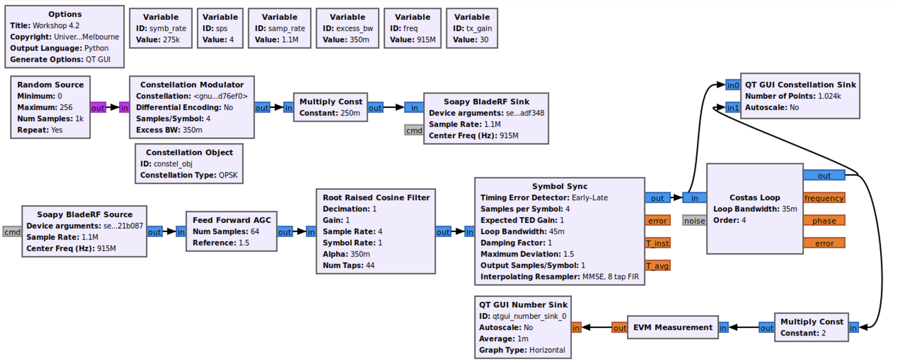
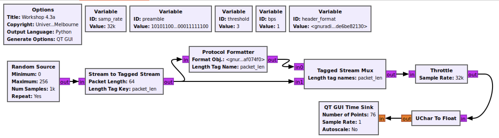
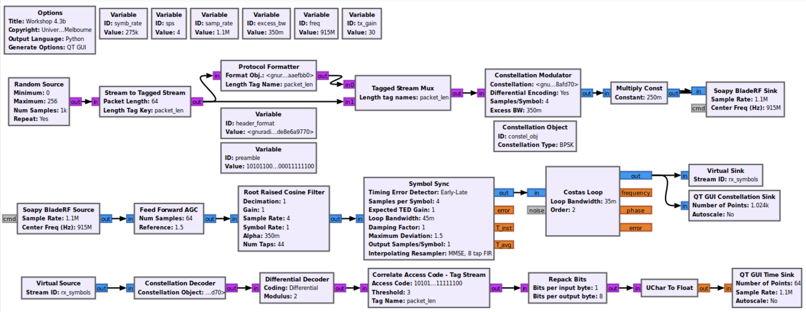

# Carrier Synchronization

This workshop guide includes activities for lecture and workshop sessions of
week 4. Please refer to the following overview slides as needed.

- [Lecture 04 - Carrier Synchronization](https://canvas.lms.unimelb.edu.au/courses/151467/pages/lecture-04-carrier-synchronization?module_item_id=4520651)
- [Workshop 04 - Packet Communication](https://canvas.lms.unimelb.edu.au/courses/151467/pages/workshop-04-packet-communications?module_item_id=4520656)

## 4.1: Carrier Frequency Offset

In the previous workshop on symbol synchronization, you operated a single
bladeRF device in a cabled RF loopback setup. When observing your received
constellation after timing recovery, you should have observed a fixed amplitude
and random phase rotation in the constellation points. The phase rotation
is a result of the signal propagation through the cable and random time at which
the local oscillators (LOs) are initialized. However, because the transmit and
received LOs are driven by the same underlying crystal oscillator no frequency
offset should have been present.

In this activity you will investigate the more realistic scenario in which the
transmit and receive chains run on seperate bladeRFs. As a result, there should
be a noticeable frequency offset present between the two devices. To begin,
connect two bladeRF devices together in an RF loopback setup as follows.

- Device A *TX1* port > 30 dB attenuator > Device B *RX1* port
- Device B *TX1* port > 30 dB attenuator > Device A *RX1* port

> **Note:** Although strictly speaking we only need to connect one transmit and
> receive port, for this setup we will connect both pairs. This will ensure that
> we do not accidentally damage the bladeRF by improperly selecting an  
> unterminated port in our GNU Radio flowgraph.

To configure the *Soapy BladeRF Sink* and *Soapy BladeRF Source* blocks to use
seperate bladeRF devices, we will need the corresponding device serial numbers.
These can be found either on the label on the underside of each device or
by running the following command after connecting the two devices to the host
computer via USB.

```
$ bladeRF-cli -p

  Description:    Nuand bladeRF 2.0
  Backend:        libusb
  Serial:         7674de4e4e284095801f09c859cb921c
  USB Bus:        4
  USB Address:    14

  Description:    Nuand bladeRF 2.0
  Backend:        libusb
  Serial:         fe9539e140b049e8b348ac8c88f5dbd9
  USB Bus:        4
  USB Address:    13
```

For a given *Soapy BladeRF* block, you can specify which bladeRF device it
should connect to by setting the parameter *Device arguments:* to be
`serial=<serial number>`. Here, you only need to enter enough initial digits of
the bladeRF's serial number to uniquely identify it, e.g., you could specify the
first device listed above by entering `serial=7674`.

Create the GNU Radio flowgraph shown in the figure below, which you will use to
measure the frequency offset between the two bladeRF devices. For the
*QT GUI Time Sink* set the *Number of points* parameter to be `n_fft` and
*Autoscale* to be `Yes`.

> **Note:** Please make sure to enter *DIFFERENT* serial numbers for the sink
> and source blocks.

<div align="center">



</div>

Run your flowgraph and determine the frequency offset between the two devices.
You should be able to determine this parameter based on the FFT bin with the
largest magnitude and the frequency of the *Signal Source* block.

> **FLUX Question:**  
> 1. What frequency offset do you measure between the two bladeRF devices?

Now that we have a measurement of the frequency offset between the two devices,
let's verify the impact on our received constellation. Modify your symbol
synchronization flowgraph of [Workshop 3](Workshop_3.md) to use separate
bladeRFs to transmit and receive. Run your flowgraph.

> **FLUX Question:**  
> 2. How does the frequency offset affect the received symbol constellation?

Although for a phase modulation such as QPSK we do not strictly need to
normalize the amplitude levels of the received constellation, this is a
requirement for proper operation of the feedback loops used in both symbol and
carrier synchronization. To do so we will add automatic gain control prior to
the matched filter block in our flowgraph. Include a *Feedforward AGC* block
after the *Soapy BladeRF Source* block in your flowgraph.

<div align="center">



</div>

Experiment with the *Reference level* parameter of the *Feedforward AGC* block
until your received symbol constellation has unit amplitude. <br>**Note:**
*Reference level* cannot be changed during flowgraph execution.

> **FLUX Question:**  
> 3. What reference level do you need to set to obtain the desired QPSK
>    constellation scaling?

## 4.2 Costas Loop

To correct for the frequency offset in our received constellation we will add a
*Costas Loop* carrier recovery block to our flowgraph. See the figure below
for the proper configuration. The Costas implementation in GNU Radio is a
*decision directed* PLL supporting BPSK, QPSK, and 8-PSK constellations. To
configure the constellation set the *Order* parameter to be the modulation order
of QPSK. The *Costas Loop* in GNU Radio is a critically damped ($\zeta = 1$)
PLL for which you can specify the normalized loop bandwidth.

> **FLUX Question:**  
> 4. Choose a loop bandwidth for the *Costas Loop* block based on the frequency
>    offset measured in Activity 4.1.

<div align="center">



</div>

Run your flowgraph and verify that the received constellation after carrier
recovery is now stationary. Experiment with the loop bandwidth to see if there
is an impact on the measured EVM. At what loop bandwidth is the loop no longer
able to acquire an initial frequency lock?

> **FLUX Question:**  
> 5. What EVM do you measure for your choice of loop bandwidth?  
> 6. At what loop bandwidth value can you no longer acquire an initial
>    frequency lock?

## 4.3 Packet Communications

In addition to correcting symbol timing and carrier frequency offsets, a
digital receiver must synchronize to the incoming stream of data symbols. In
the case of a continuous stream of transmitted symbols, this is because the
receiver will not start operating at the exact time the transmitter begins its
transmission. In the case of bursty communications, in which transmissions are
discontinuous, the receiver will not know a priori when or even if the
transmitter will send data.

The solution is to group data symbols into delimited *packets* or *frames* and
insert a known sequence of symbols within each packet for which the receiver
can search. This known symbol sequence is alternatively called a preamble, an
access code, a pilot sequence, or a training sequence. Often the preamble is
grouped together with other control information into a packet *header* which
can inform the digital receiver about the format of the data packet, e.g.,
the modulation employed or the number of data bytes in the packet (the length
of the packet *payload*).

```
------------------------------------------
|  Header  |           Payload           |
------------------------------------------
```

### Protocol Formatter

Within GNU Radio, we can use the *Protocol Formatter* block to generate a
packet header with a configurable format. We will first examine the process of
inserting a packet header into a stream of data symbols in GNU Radio before
moving on to the process of packet or frame recovery at the receiver. Create
the GNU Radio flowgraph depicted in the figure below.

<div align="center">



</div>

There are two variables to highlight in this flowgraph. The first is *preamble*,
which specifies the bit sequence we will insert to delimit the beginning of a
packet. In this example we will set the preamble to be the default preamble in
GNU Radio,

- *preamble*: `digital.packet_utils.default_access_code`

This preamble is a 64-bit sequence represented by the hexadecimal string
`\xac\xdd\xa4\xe2\xf2\x8c\x20\xfc`. The next key variable is *header_format*,
which is the object used to actually generate the header. For this example we
will create an object of the default GNU Radio header class.

- *header_format*: `digital.header_format_default(preamble, threshold, bps)`

The default header format is composed of a variable length access code (in our
case 64 bits) followed by two 16-bit fields which repeat the length of the
current packet payload in bytes. Overall, this gives us a 12-byte header with
the following 32-bit word arrangement.

```
| Word  | 32    -    16 | 15    -     0 |
| ----- | ------------- | ------------- |
|   0   |          Access Code          |
|   1   |          Access Code          |
|   2   | Packet Length | Packet Length |
```

This example also employs another important GNU Radio tool, the *Stream Tag*.
Stream tags are used to attach control information to specific samples in a
data stream, where each tag is a *key-value* pair that can be observed by all
downstream blocks. As stream tags are a useful way for GNU Radio blocks to
communicate with one another, it is worth spending some time reviewing the GNU
Radio tutorial on the topic.

- [Stream Tags](https://wiki.gnuradio.org/index.php?title=Stream_Tags)

Within our flowgraph, the following blocks use stream tags for their operation.

- *Stream to Tagged Stream*: - Attaches the tag `packet_len: 64` to every 64th
byte in our stream. This effectively packetizes our data into packets with a
payload size of 64 bytes.
- *Protocol Formatter*: Looks for `packet_len` tags on its input port to
determine how long each packet is. Creates a packet header based on the
formatter provided for each packet tag it encounters. Note the header output
will also be tagged with `packet_len: 12` as our header is 12 bytes long.
- *Tagged Stream MUX*: Multiplexes two tagged streams on its input ports, where
the number of consecutive samples taken from each port is determined by the
`packet_len` tag encountered on each port.

We can also use stream tags within our *QT GUI Time Sink* to trigger when the
data is plotted. This can be helpful to align the plotted data to a known
starting point. For this example set the following parameters in the the
*QT GUI Time Sink* block to plot one packet at a time.

| Parameter        |     Value      |
| ---------------- | :------------: |
| *General*        |                |
| Y_max:           |     `256`      |
| Number of Points |     `76`       |
| *Trigger*        |                |
| Trigger Mode     |     `Tag`      |
| Tigger Tag Key   | `"packet_len"` |

Run your GNU Radio flowgrpah.

> **FLUX Question:**  
> 7. How many of the initial bytes in each packet are the same? Can you explain
>    this?

### Preamble Detection

To achieve frame synchronization, the receiver can search for the inserted
preamble in its received data. GNU Radio supports searching for the preamble
either within the received symbol stream or the demodulated bit stream. For the
latter case, we can use the *Correlated Access Code - Tagged Stream* block.

Add the packet header generating blocks to your Costas Loop RF loopback
flowgraph with the. Include receiver blocks for demodulating the received
symbols and searching for the preamble as depicted in the figure below. A few
notes for this flowgraph.

- For simplicity, you can use a single BladeRF device in RF loopback rather
  than two devices.
- Change the modulation format from QPSK to BPSK.
- Set the *Constellation Modulator* to use differential encoding as we need to
  remove the remaining phase ambiguity in the received constellation.

<div align="center">



</div>

We have added a number of blocks to our flowgraph to map from the received
symbols to packets of payload bytes. These new blocks perform the following
functionality.

- *Constellation Decoder* - Makes a hard decision about each received symbol
  and maps to the corresponding transmitted bits based on the constellation
  object provided. Each output byte will have $\log_2(M)$ significant bits,
  where $M$ is the modulation order.
- *Differential Decoder* - Reverses the differential encoding applied at the
   transmitter to counteract phase ambiguity in the received symbol
   constellation.
- *Repack Bits* - Packs received bits to bytes with 8 significant bits. For our
  flowgraph make sure to set the parameters as follows.
  - *Bits per input byte*: `constel_obj.bits_per_symbol()`
  - *Alignment*: `Output`
  - *Endianness*: `MSB`

The *Correlate Access Code - Tagged Stream* block is what actually searches for
our preamble in the stream of received bits. It does so by correlating the
received bit sequence, $b[k]$, with the bits of the preamble, $p[k]$. At each
sample time $k$ it checks how many the next 64 bits differ from corresponding
bits in the preamble, i.e., it computes the following metric,

```math
\sum_{i=0}^{N_\text{preamble} - 1} b[k + i] \oplus p[i]
```

This is the *Hamming distance* between the preamble and the received bits. If
the number of bit differences is below the configured *threshold*, then the
block will declare the preamble found. It discards the 64 bits of the
preamble and then inspects the next 32-bits that contain the packet length
repeated twice. If the two packet length fields match, the block uses this
length to tag the output stream with a corresponding `packet_len` tag.

Run your GNU Radio flowgraph.

> **FLUX Question:**
> 8. Is your receiver able to successfully detect packets?
> 9. How will the length of the preamble sequence impact the reliability of
>    of its detection?

Additional details on the use of packet-based communication in GNU Radio can be
found in the following tutorial.

- [Packet Communications](https://wiki.gnuradio.org/index.php?title=Packet_Communications)
